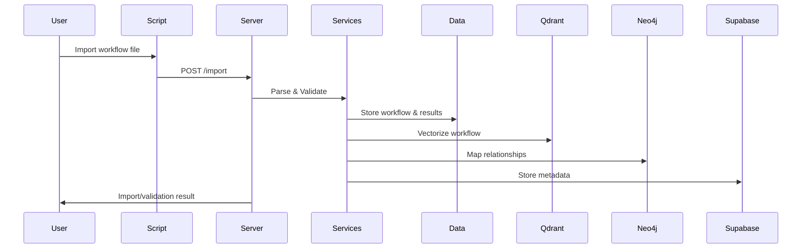

# Comprehensive Context Documentation

## 1. Visual Representation of Component Relationships

```mermaid
graph TD
  subgraph Main Application (src)
    Server["server.js (MCP Server Entry Point)"]
    Services["services/ (Business Logic)"]
    Tools["tools/ (MCP Tool Definitions)"]
    Utils["utils/ (Shared Utilities)"]
    Types["types/ (Type Definitions)"]
    Config["config/ (Configuration)"]
  end
  Data["data/ (Workflow & Processed Data)"]
  Scripts["scripts/ (Dev & Maintenance Scripts)"]
  Tests["tests/ (Unit & Integration Tests)"]
  Docs["docs/ (Guides & Architecture)"]
  Logs["logs/ (Application Logs)"]
  ConfigDir["config/ (Env Configs)"]

  Server --> Services
  Server --> Tools
  Server --> Utils
  Server --> Types
  Server --> Config
  Services -->|n8n, Qdrant, Neo4j, Supabase| Data
  Tools --> Services
  Scripts --> Data
  Scripts --> Services
  Tests --> Services
  Docs --> Server
  Docs --> Services
  Docs --> Tools
  Docs --> Data
  ConfigDir --> Server
  ConfigDir --> Services
  Logs --> Server
  Logs --> Services
```

## 2. Key Abstractions, Patterns, and Architectural Decisions

- **Service-Oriented Architecture**: Core business logic is encapsulated in service modules (n8n, workflow parsing/validation, Qdrant, Neo4j, Supabase).
- **Modular Tooling**: Tools are organized by domain (workflow, execution, integration) for extensibility and separation of concerns.
- **Data Layer Abstraction**: Data is separated into raw workflows, processed data, and exports, supporting scalable data management.
- **Legacy Migration**: Legacy scripts are isolated in `scripts/legacy` to enable gradual migration to the new modular structure.
- **Centralized Logging**: All logical connections and workflows are logged using Winston, supporting traceability and debugging.
- **Configuration Management**: Environment and runtime configuration are separated for clarity and maintainability.
- **Test-Driven Development**: Comprehensive unit and integration tests are maintained for all major modules.

## 3. Component Interaction Flows & Data Models

### Workflow Lifecycle
1. **Import/Parse**: Workflows are imported and parsed via scripts or API endpoints.
2. **Validation**: Workflows are validated against best practices using the workflow-validator service.
3. **Storage**: Validated workflows are stored in the data layer (raw, processed, or exported as needed).
4. **Vectorization**: Workflows can be vectorized for semantic search using Qdrant.
5. **Graph Operations**: Workflow relationships and patterns are mapped in Neo4j.
6. **Relational Storage**: Metadata and analytics are stored in Supabase.
7. **Batch/Sync**: Batch operations and real-time sync keep all data sources up to date.

### Data Model Overview
- **Workflow**: { id, name, nodes, connections, tags, metadata }
- **Processed Workflow**: { workflowId, parsedData, validationResults, vectorEmbedding, graphRelations }
- **Export**: { exportId, workflowIds, exportType, exportDate }
- **Log Entry**: { timestamp, level, message, context }

### Example Interaction Flow


---

**This document should be updated as the architecture evolves. Use it for onboarding, architecture reviews, and dependency tracking.** 