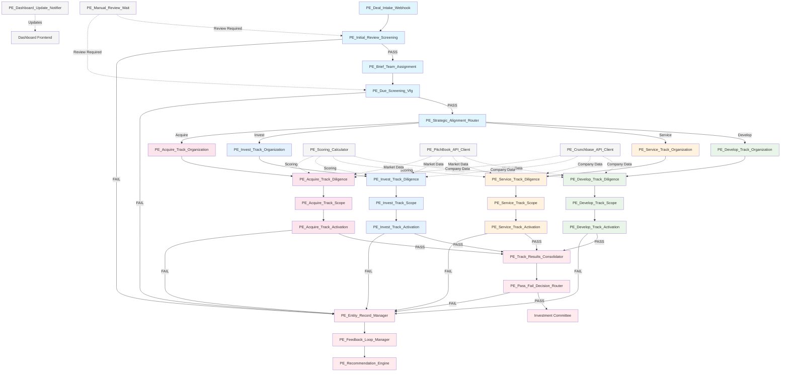

```mermaid
graph TD
    %% Prospecting Stage
    A[PE_Deal_Intake_Webhook] --> B[PE_Initial_Review_Screening]
    B -->|PASS| C[PE_Brief_Team_Assignment]
    B -->|FAIL| Z1[PE_Entity_Record_Manager]
    C --> D[PE_Due_Screening_Vfg]
    D -->|PASS| E[PE_Strategic_Alignment_Router]
    D -->|FAIL| Z1
    
    %% Alignment Stage - Four Parallel Tracks
    E -->|Develop| F1[PE_Develop_Track_Organization]
    E -->|Service| G1[PE_Service_Track_Organization]
    E -->|Invest| H1[PE_Invest_Track_Organization]
    E -->|Acquire| I1[PE_Acquire_Track_Organization]
    
    %% Develop Track
    F1 --> F2[PE_Develop_Track_Diligence]
    F2 --> F3[PE_Develop_Track_Scope]
    F3 --> F4[PE_Develop_Track_Activation]
    F4 -->|PASS| J[PE_Track_Results_Consolidator]
    F4 -->|FAIL| Z1
    
    %% Service Track
    G1 --> G2[PE_Service_Track_Diligence]
    G2 --> G3[PE_Service_Track_Scope]
    G3 --> G4[PE_Service_Track_Activation]
    G4 -->|PASS| J
    G4 -->|FAIL| Z1
    
    %% Invest Track
    H1 --> H2[PE_Invest_Track_Diligence]
    H2 --> H3[PE_Invest_Track_Scope]
    H3 --> H4[PE_Invest_Track_Activation]
    H4 -->|PASS| J
    H4 -->|FAIL| Z1
    
    %% Acquire Track
    I1 --> I2[PE_Acquire_Track_Diligence]
    I2 --> I3[PE_Acquire_Track_Scope]
    I3 --> I4[PE_Acquire_Track_Activation]
    I4 -->|PASS| J
    I4 -->|FAIL| Z1
    
    %% Final Decision and Feedback
    J --> K[PE_Pass_Fail_Decision_Router]
    K -->|PASS| L[Investment Committee]
    K -->|FAIL| Z1
    Z1 --> M[PE_Feedback_Loop_Manager]
    M --> N[PE_Recommendation_Engine]
    
    %% Support Nodes
    O[PE_Manual_Review_Wait] -.->|Review Required| B
    O -.->|Review Required| D
    P[PE_Scoring_Calculator] -.->|Scoring| F2
    P -.->|Scoring| G2
    P -.->|Scoring| H2
    P -.->|Scoring| I2
    Q[PE_Dashboard_Update_Notifier] -.->|Updates| R[Dashboard Frontend]
    
    %% External APIs
    S[PE_PitchBook_API_Client] -.->|Market Data| F2
    S -.->|Market Data| G2
    S -.->|Market Data| H2
    S -.->|Market Data| I2
    T[PE_Crunchbase_API_Client] -.->|Company Data| F2
    T -.->|Company Data| G2
    T -.->|Company Data| H2
    T -.->|Company Data| I2
    
    %% Styling
    classDef prospectingStage fill:#e1f5fe
    classDef alignmentStage fill:#f3e5f5
    classDef developTrack fill:#e8f5e8
    classDef serviceTrack fill:#fff3e0
    classDef investTrack fill:#e3f2fd
    classDef acquireTrack fill:#fce4ec
    classDef decisionNode fill:#ffebee
    classDef supportNode fill:#f5f5f5
    
    class A,B,C,D,E prospectingStage
    class F1,F2,F3,F4 developTrack
    class G1,G2,G3,G4 serviceTrack
    class H1,H2,H3,H4 investTrack
    class I1,I2,I3,I4 acquireTrack
    class J,K,L,Z1,M,N decisionNode
    class O,P,Q,R,S,T supportNode
```